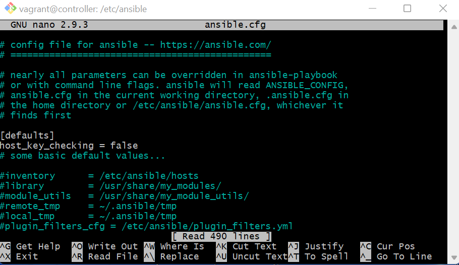

## IaC Configuration with Ansible


### Steps:
- I created a new repo on git hub called IaC with Ansible
- Inside that created folder called IaC_Conf_Ansible
-*nside that folder I created (downloaded) vagrant file

### Launch 3 VMs (controller,web and db):
- Open the terminal and from the location where your vagrant file is
- run 'vagrant up'
- It will launch 3 VMs, as instructed in the vagrant file.
- Now run 'vagrant status' to check the status of machines


- Now, SSH into the controller machine by 'vagrant ssh controller'


## Once you ssh into the controller machine, setup Ansible:

- Run 'sudo apt-get update -y'
- 'sudo apt-get upgrade -y'
- run 'sudo apt-get install software-properties-common' to download any remaining software packages
  
- Then, run 'sudo apt-add-repository ppa:ansible/ansible'
- 'sudo apt-get install ansible -y' ## installs Ansible 
  
  - To check if Ansible is installed, run 'ansible --version'
  - 'sudo apt install tree' for designing of folders
  
- Inside controller machine go to ansible folder by 'cd /etc/ansible'
  
  - From controller you can ssh into the multiple machines.
  - To ssh into the web machine
  - run 'ssh vagrant@ip of machine'

- To ssh into web vm 'ssh vagrant@192.168.33.10'
- To ssh into db vm 'ssh vagrant@192.168.33.11'
  

### Updating the hosts in controller:
- In terms to establish connection between Ansible controller machine (master machine), we need to provide name, IP and ssh details of those agents(servers, VMs) that we need to connect


- For that into controller machine:
- 'cd /etc/ansible/'

- From that location run 'sudo nano hosts'
- and include following:

- [web]
192.168.33.10 ansible_connection=ssh ansible_ssh_user=vagrant ansible_ssh_pass=vagrant  (To connect web server/machine)

- [db]
192.168.33.11 ansible_connection=ssh ansible_ssh_user=vagrant ansible_ssh_pass=vagrant  (To connect db server)

- Provide respective ips of servers (192.168.33.10 is for web and 192.168.33.11 is for db)

## To check if the connection b/w controller and agents has been established, run following 

- 'sudo ansible web -m ping' (To check connection b/w controller and web)


- 'sudo ansible db -m ping' (To check connection b/w controller and db)
- If above command doesn't work then run 'ansible db -m ping'

- If ping status is still not green then edit ansible.cfg file and add: (This is not recommanded in production)
- Go to cd /etc/ansible/ then sudo nano ansible.cfg
 [defaults]
 host_key_checking = false




## Some Ansible ad-hoc commands:
- 'ansible web -a "uname -a"' to check os of machine
- ansible web -a "free"  - to check storage of web machine
  OR
- You can use 'all' to check for every machines/servers
- Ex: 'ansible all -a "uname -a"
- 'ansible all -a "free"
- 'ansible all -a "systemctl status nginx"

- To copy files from Ansible controller to hosts/ agent vms:
- sudo ansible web -m copy -a "src=/etc/ansible/test.text dest=/home/vagrant"

## Playbook:
- From controller, we can create playbooks which will do the tasks inside multiple VMs without us ssh into perticular machine and do it manually.


### Playbook for Ngins installation in web VM

```

# create a playbook to install nginx web server inside web
# --- three dashes at the start of the file of YAML

---

# add hosts or name of the host server
- hosts: web


# indentation is EXTREMELY IMPORTANT
# gather live information

  gather_facts: yes
# we need admin access

  become: true

# add the instructions
# install nginx in web server

  tasks:
  - name: Install Nginx
    apt: pkg=nginx state=present

# the nginx server status is running
```


### Playbook for Nodejs

```
---

- hosts: web

  gather_facts: yes

  become: true


  tasks:
  - name: Install nodejs
    apt: pkg=nodejs state=present
```


### Playbook for Reverse proxy:

```


---

# add hosts or name of the host server
- hosts: web


# indentation is EXTREMELY IMPORTANT  
# gather live information

  gather_facts: yes
# we need admin access

  become: true

# add the instructions
# install nginx in web server

  tasks:
  - name: Remove defualt Nginx file
    file:
      path: /etc/nginx/sites-enabled/default
      state: absent

  - name: create a file to replace
    file:
      path: /etc/nginx/sites-enabled/reverseproxy.conf
      state: touch
      mode: '666'

  - name: insert code lines
    blockinfile:
      path: /etc/nginx/sites-enabled/reverseproxy.conf
      backup: yes
      block:  |
        server {
          listen 80;
          listen [::]:80;

        access_log /var/log/nginx/reverse-access.log;
        error_log /var/log/nginx/reverse-error.log;

          location / {
                    proxy_pass http://localhost:3000;
          }
        }
```

### Playbook for NPM

```
---

# add hosts or name of the host server
- hosts: web


# indentation is EXTREMELY IMPORTANT  
# gather live information
vagrant@controller:/etc/ansible$ cat npm-playbook.yml
---

# add hosts or name of the host server
- hosts: web


# indentation is EXTREMELY IMPORTANT  
# gather live information

  gather_facts: yes
# we need admin access

  become: true

# add the instructions
# install nginx in web server

  tasks:
  - name: Install Npm
    apt: pkg=npm state=present

```
